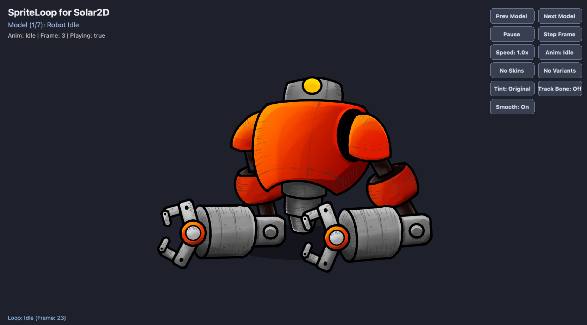

# spriteloop
*spriteloop* is a pure Lua SpriteLoop (`.spla`) Importer and Animation Player for Solar2D (formerly Corona SDK).



In a single, clean module, **spriteloop** loads SpriteLoop cut-out animation packages (`.spla` zip archives or pre-extracted directories) and turns them into native Solar2D display objects with full playback, skinning, and bone-tracking support.

- [x] Loads `.spla` packages exported from [SpriteLoop](https://spriteloop.com)
- [x] Supports both `.spla` archives (via `plugin.zip`) and pre-extracted folders (zero external dependencies)
- [x] Returns standard Solar2D `display.newGroup()` objects that integrate seamlessly into scenes, physics, and transitions
- [x] Hierarchical transforms with position, rotation, scale, opacity, and anchor-based pivots
- [x] Full support for **Skew** transformations using Solar2D's native 2.5D quadrilateral path distortion (no custom shaders required)
- [x] **Sub-frame Linear Interpolation (Lerp)** with shortest-arc angle wrapping for buttery-smooth 60+ FPS playback at any speed (including slow-motion)
- [x] Runtime character skinning (`:setSkin()`) and manual part variant swapping (`:setVariant()`)
- [x] Full playback controls: play, pause, resume, stop, frame scrubbing, variable speed multipliers, and loop overrides
- [x] Timeline keyframe events, loop notifications, and completion callbacks
- [x] Runtime character RGB tinting (`:setTint()`)
- [x] Bone / part attachment queries (`:getPartTransform()`) for pinning weapons, health bars, and particle emitters to moving limbs
- [x] Automatic memory management and listener cleanup on `finalize`

---

### Quick Start Guide

```lua
local spriteloop = require "com.ponywolf.spriteloop"
local character = spriteloop.new( "spla/robot_idle" )
```

#### path

`path` is the path to your SpriteLoop file or folder. You can pass:
1. **A pre-extracted folder** containing `manifest.json` and an `assets/` subfolder (e.g. `"spla/robot_idle"` or `"spla/robot_idle/manifest.json"`). This requires zero external plugins.
2. **A `.spla` archive file** (e.g. `"spla/robot_idle.spla"`). When `plugin.zip` is installed in `build.settings`, **spriteloop** will automatically extract the archive to `system.CachesDirectory`.

```lua
-- Load from pre-extracted directory
local hero = spriteloop.new( "spla/ranger_idle" )

-- Load from .spla archive
local robot = spriteloop.new( "spla/robot.spla" )
```

#### options

You can pass an optional table of configuration parameters to `spriteloop.new()`:

```lua
local character = spriteloop.new( "spla/ranger_idle", {
    skin = "Demon",            -- Initial skin to apply (default: package default)
    anim = "Idle",             -- Initial animation to select (default: first animation)
    autoplay = true,           -- Start playing immediately (default: true)
    loop = true,               -- Override looping setting (default: animation default)
    playbackRate = 1.0,        -- Playback speed multiplier (default: 1.0)
    interpolate = true,        -- Smooth sub-frame lerp interpolation (default: true)
    x = display.contentCenterX,
    y = display.contentCenterY,
    baseDir = system.ResourceDirectory, -- Base directory for relative paths
})
```

#### character display object

**spriteloop** returns a display object that is a standard Solar2D `display.newGroup()`. The character is centered around its authored canvas origin `(0, 0)`.

You can move, scale, rotate, fade, transition, and insert the character just like any standard display group:

```lua
character.x = 200
character.y = 300
character.xScale = 0.8
character.yScale = 0.8
character.alpha = 0.9

-- Transitions and physics
transition.to( character, { time = 1000, x = 400 } )
physics.addBody( character, "dynamic", { radius = 40 } )
```

---

### Playback Controls

#### character:play( [animation] [, options] )
Plays an animation by name or ID. If omitted, plays the current or first available animation.

```lua
-- Basic play
character:play("walk")

-- Play with inline options and callbacks
character:play("attack", {
    loop = false,
    playbackRate = 1.2,
    onEvent = function(event)
        print("Timeline event:", event.eventName, event.eventData)
    end,
    onComplete = function(event)
        print("Attack finished, returning to idle...")
        character:play("idle", { loop = true })
    end,
})
```

#### character:pause()
Pauses animation playback on the current frame.

```lua
character:pause()
```

#### character:resume()
Resumes playback from the current position.

```lua
character:resume()
```

#### character:stop()
Stops playback and resets to frame 0.

```lua
character:stop()
```

#### character:setFrame( frameIndex [, options] )
Jumps directly to a discrete 0-based frame index.

```lua
character:setFrame( 10 )
```

#### character:setTime( seconds [, options] )
Sets the playback position to an absolute time in seconds.

```lua
character:setTime( 0.5 )
```

#### character:setPlaybackRate( rate )
Sets the playback speed multiplier.

```lua
character:setPlaybackRate( 0.5 ) -- Half speed slow-motion
character:setPlaybackRate( 2.0 ) -- Double speed
```

#### character:setInterpolated( boolean )
Enables or disables smooth sub-frame interpolation between keyframes. When enabled (default), animations render smoothly at 60+ FPS even when slowed down.

```lua
character:setInterpolated( true )  -- Smooth 60fps sub-frame blending
character:setInterpolated( false ) -- Classic stepped keyframe stepping
```

---

### Skins & Part Variants

#### character:setSkin( skinNameOrId )
Applies a predefined character skin, updating part variants, visibility, and sprite states in one call.

```lua
character:setSkin( "Demon" )
character:setSkin( "blue_robot" )
```

#### character:setVariant( partNameOrId, variantNameOrId )
Overrides an individual part's appearance with a specific variant.

```lua
-- Equip a helmet on the head part
character:setVariant( "head", "head_helmet" )

-- Pass "default" to remove the manual override for that part
character:setVariant( "head", "default" )
```

#### character:clearVariant( partNameOrId )
Clears the manual variant override for a specific part, restoring its skin/base asset.

```lua
character:clearVariant( "head" )
```

#### character:clearVariants()
Clears all manual part overrides across the entire character.

```lua
character:clearVariants()
```

---

### Runtime Tinting

#### character:setTint( r, g, b )
Multiplies the character's authored colors by a custom RGB multiplier (values from 0.0 to 1.0).

```lua
character:setTint( 1.0, 0.4, 0.4 ) -- Flash red (damage)
character:setTint( 0.4, 1.0, 0.5 ) -- Poison green
```

#### character:clearTint()
Resets character tint to full white `(1, 1, 1)`.

```lua
character:clearTint()
```

---

### Bone Tracking & Attachments

#### character:getPartTransform( partNameOrId [, options] )
Returns the resolved position, rotation, scale, opacity, and skew of any part in the current frame. This allows you to lock accessories, weapons, health bars, or particle emitters to moving character limbs.

Options:
* `origin = "pivot"` (default) — Returns coordinates at the authored pivot point.
* `origin = "center"` — Returns coordinates at the visual center of the part.

```lua
-- Create a sword display object
local sword = display.newImageRect( "assets/sword.png", 32, 64 )

-- Track right hand in enterFrame
Runtime:addEventListener( "enterFrame", function()
    local t = character:getPartTransform( "right_hand", { origin = "pivot" } )
    if t then
        sword.x = character.x + t.x * character.xScale
        sword.y = character.y + t.y * character.yScale
        sword.rotation = character.rotation + t.rotation
    end
end )
```

> **Tip:** Empty Parts / Attachment Bones authored in SpriteLoop (`"kind": "empty"`) are invisible by design and serve as dedicated tracking nodes for `:getPartTransform()`.

---

### Timeline Events

SpriteLoop animations can emit custom timeline events authored on specific frames (e.g. `"footstep"`, `"attack_hit"`, `"slash"`).

#### Solar2D Event Listener
Listen for `"spriteloop"` events on the character display object:

```lua
character:addEventListener( "spriteloop", function( event )
    if event.phase == "event" then
        print( "Frame Event:", event.eventName, "Payload:", event.eventData, "Frame:", event.frame )
    elseif event.phase == "loop" then
        print( "Animation looped:", event.animation )
    elseif event.phase == "complete" then
        print( "Animation complete:", event.animation )
    end
end )
```

---

### Package Info & Discovery

#### character:getInfo()
Returns metadata about the loaded package, including available animations, skins, variants, and parts:

```lua
local info = character:getInfo()

print( "Character:", info.name, "Canvas:", info.canvasWidth .. "x" .. info.canvasHeight )
print( "Active Skin:", info.activeSkin )

for _, anim in ipairs( info.animations ) do
    print( "Animation:", anim.name, "FPS:", anim.fps, "Frames:", anim.frameCount )
end

for _, skin in ipairs( info.skins ) do
    print( "Available Skin:", skin.name )
end
```

---

### Watchouts & Tips

* **Zip Plugin (`.spla` Archives)**: To load compressed `.spla` files directly at runtime, include `plugin.zip` in your `build.settings`:
  ```lua
  settings = {
      plugins = {
          ["plugin.zip"] = {
              publisherId = "com.coronalabs",
          },
      },
  }
  ```
* **Zero-Dependency Mode**: If you prefer not to include `plugin.zip`, simply unzip your `.spla` files into a folder in your project and pass the folder path (e.g. `"spla/robot_idle"`).
* **Empty Parts**: Parts without image assets or marked as `kind = "empty"` are used as invisible attachment targets and will not render any placeholder shapes.
